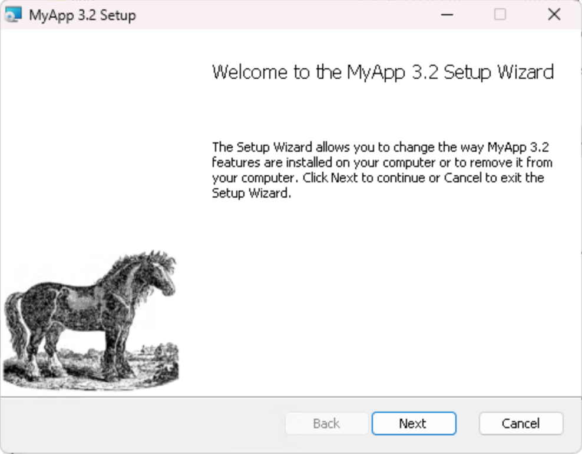
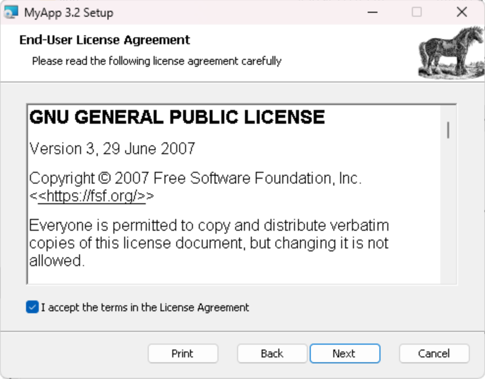
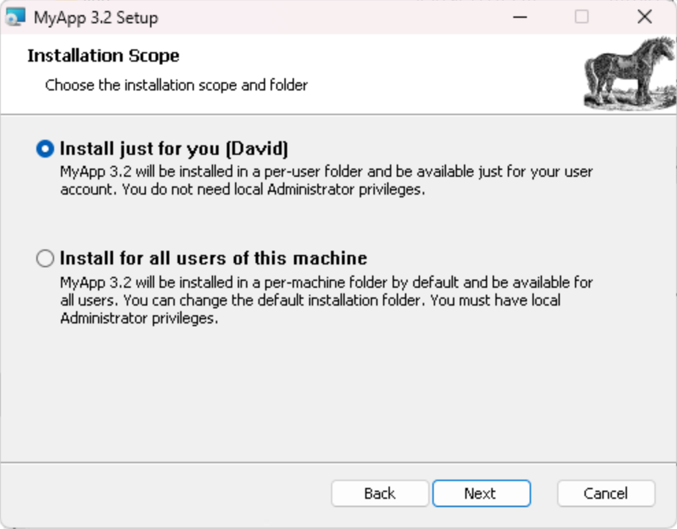
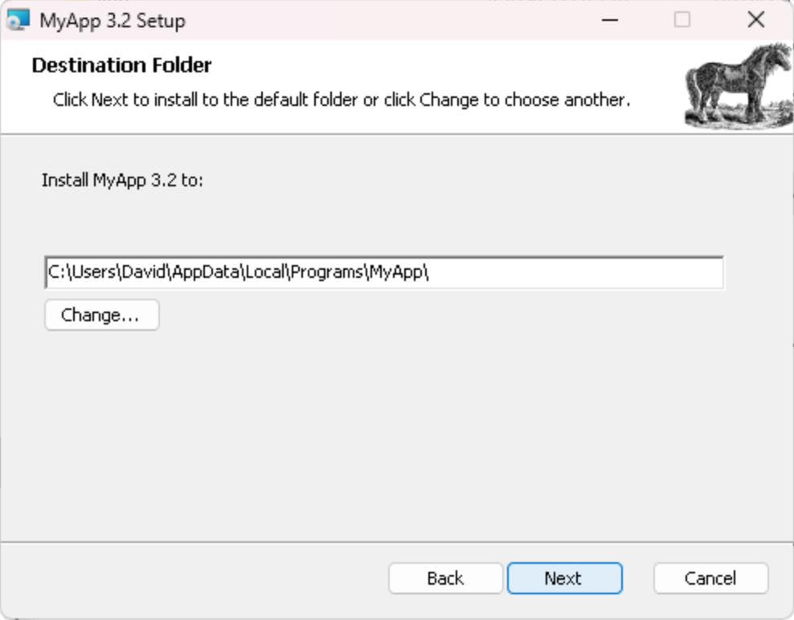
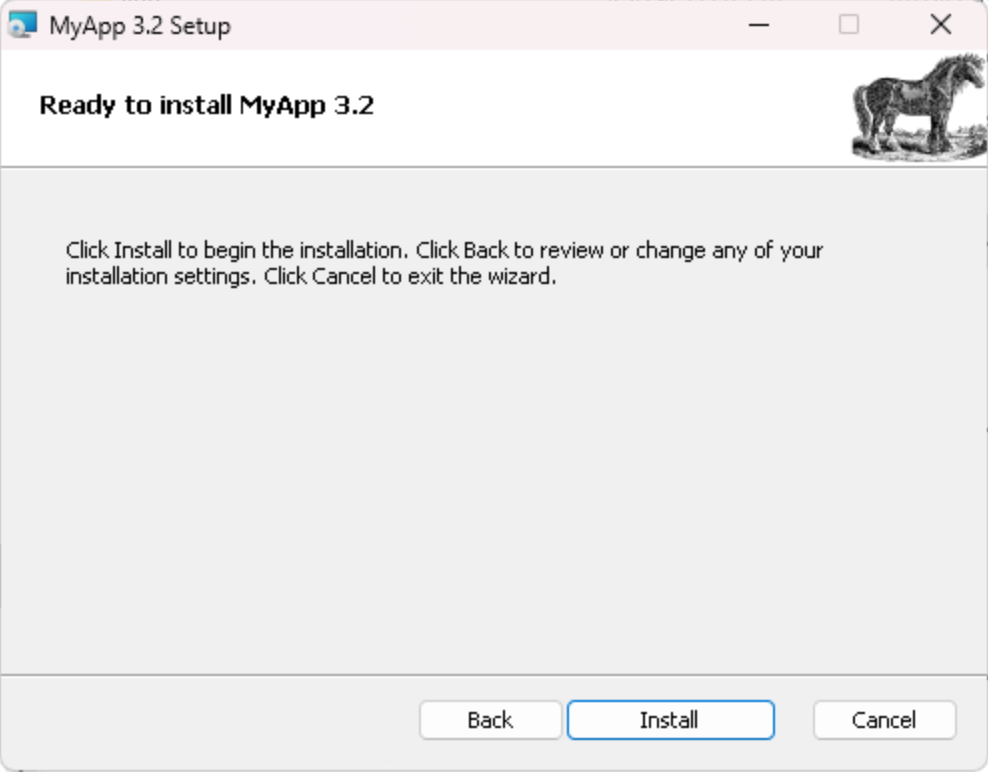
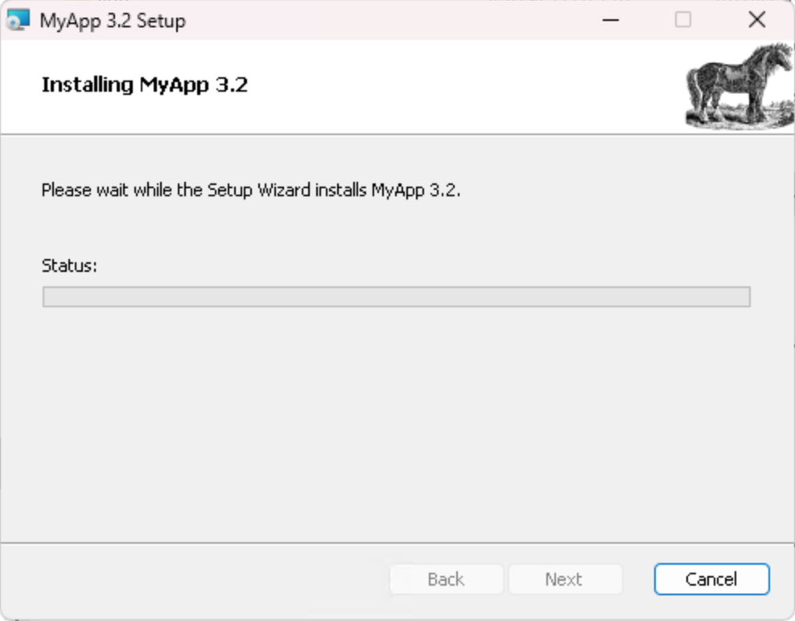
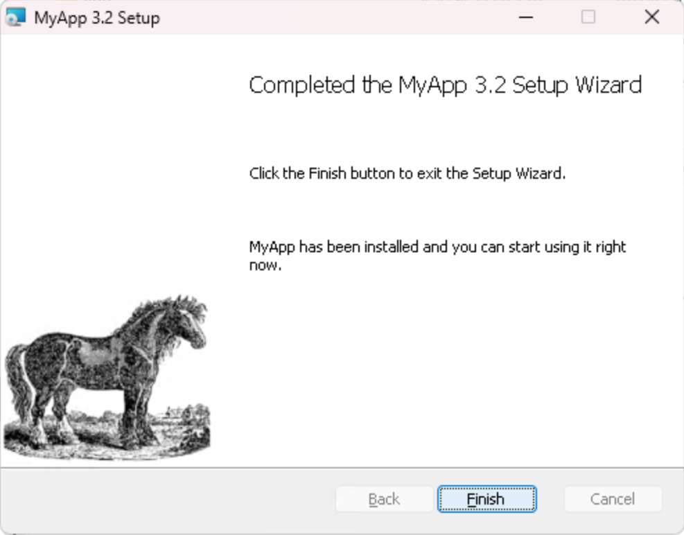

# OCaml Universal Installer

OCaml Universal Installer or oui, is a tool that produces standalone installers
for your OCaml applications, be it for Linux, Windows or macOS.

## How it works

`oui` needs two things to generate an installer:
1. an installation bundle. It's simply a directory containing all the files you
   want to install: binaries, compiled artifacts such as `.cmxs` for dynamic
   linking, documentation, data files.
2. a `oui.json` configuration file. It contains information that `oui` needs
   to properly generate the installer. Some fields are shared across all
   backends and some are specific to one. Among other things, it contains
   paths, relative to the installation bundle's root, to files or folders
   that require special treatment during the install such as binaries or
   manpages. The full file format is described in the
   [`oui.json` file format](ouijson-file-format) section.

Unless you are relying on one of `oui`'s frontend to build them, you will
need to provide both those things. The
[Generating a binary installer for your dune
project](generating-a-binary-installer-for-your-dune-project) section
provides a good example on how to build them.

## `oui.json` file format

*TODO*

## Generating a binary installer for your dune project

If you're developping an application in OCaml you are most likely to use
`dune` as your main build system so here's how you can produce a binary
installer with `oui` from your `dune` project.

In the future we will likely provide a `dune` fronted to `oui` so that you
don't have to go through the following steps yourself for regular `dune`
projects but in the meantime you can follow the instructions below.

### Generating the installation bundle

In the vast majority of cases you can rely on `dune install` to generate
the installation bundle for you. From the root of your project run:

```
dune build @install
dune install --relocatable --prefix <install-bundle-dir>
```

This will generate a good starting point for an installation bundle in
`<install-bundle-dir>`.

Note that this will install all packages in your project. If you define
more than one but don't want to bundle them all together in a single installer
you can add the `-p <package-name>` option to the `dune build` command.

The `--relocatable` flag is particularly important if you are using
`dune-site` as it would otherwise insert hardcoded absolute paths in your
binaries.

This installation bundle is likely to contain files that don't necessarily
matter to your non OCaml end users and that you might want to strip from
the bundle such as source files or intermediate compiled artifacts.

Here's a simple script you can run to filter out any such files from the `dune`
generated bundle:

```sh
#!/usr/bin/env bash
set -euo pipefail

# Clean up an OCaml installation directory after `dune install`
# Removes development artifacts and keeps only what’s needed
# for a binary distribution (executables, .cmxs, docs, etc.)

QUIET=""

# Parse options
if [ "${1:-}" = "--quiet" ]; then
  QUIET=true
  shift
fi

if [ -n "$QUIET" ]; then
  FIND_DELETE=(-delete)
else
  FIND_DELETE=(-print -delete)
fi

if [ -z "$1" ]; then
  echo "Usage: $0 [INSTALL_DIR]" >&2
  exit 1
fi

INSTALL_DIR=$1

if [ ! -d "$INSTALL_DIR" ]; then
  echo "Error: directory '$INSTALL_DIR' does not exist" >&2
  exit 1
fi

if [ -n "$QUIET" ]; then
  echo "Cleaning up install directory: $INSTALL_DIR"
fi

# Patterns of files to remove
TO_REMOVE=(
  "*.ml"
  "*.mli"
  "*.cmi"
  "*.cmo"
  "*.cmx"
  "*.cmxa"
  "*.cma"
  "*.a"
  "*.cmt"
  "*.cmti"
  "dune-package"
  "opam"
  "*.opam"
  "*.mld"
)

# --- Remove Unwanted files ---
for pattern in "${TO_REMOVE[@]}"; do
  find "$INSTALL_DIR" -type f -name "$pattern" "${FIND_DELETE[@]}"
done

# --- Remove empty directories (after cleanup) ---
find "$INSTALL_DIR" -type d -empty "${FIND_DELETE[@]}"

if [ -n "$QUIET" ]; then
  echo "Cleanup complete!"
fi
```

After running this script on your installation bundle it should be ready
for `oui`!

Note that if you are using `dune-site` for plugins support, you will need
to install `META` files as its plugin loading mechanism relies on them.
That's the main reason why the above script does not remove `META` files.

### Writing the `oui.json` config file

Here we are going to use [alt-ergo](https://github.com/OCamlPro/alt-ergo) as an
example.

Generating the installation bundle, following the steps from the previous
section yields the following:
```
alt-ergo.dev
├── bin
│   └── alt-ergo
├── doc
│   └── alt-ergo
│       ├── CHANGES.md
│       ├── LICENSE.md
│       └── README.md
├── lib
│   └── alt-ergo
│       ├── plugins
│       │   └── fm-simplex
│       │       └── FmSimplexPlugin.cmxs
│       └── __private__
│           └── alt_ergo_common
│               └── alt_ergo_common.cmxs
└── man
    └── man1
        └── alt-ergo.1
```

The important parts here are the main binary in `bin/` and the manpage
in `man/man1/alt-ergo.1`.

Here is the `oui.json` file we'd use to generate `alt-ergo`'s installer:
```json
{
  "name": "alt-ergo",
  "fullname": "alt-ergo.dev",
  "version": "dev",
  "description": "Alt-Ergo is an automatic theorem prover of mathematical formulas. It was developed at LRI, and is now maintained at OCamlPro.",
  "manufacturer": "alt-ergo@ocamlpro.com",
  "exec_files": ["bin/alt-ergo"],
  "makeself_manpages": {
    "man1": [
      "man/man1/alt-ergo.1"
    ]
  }
}
```

The content of `oui.json` isn't likely to change much and is closely tied
to your dune project's structure itself so we recommend committing it to your
repo and updating it as needed through your project's development.
For convenience, it should be written to the root of the repo alongside your
`dune-project`.

### Generating the installer

Now you can generate the installer by running:
```
oui oui.json <installation-bundle-dir>
```

## Installation layout

oui aims at producing the most consistent installs across platforms but each
as its own specifities.

The following sections describes how an application is installed on the three
main platform it supports.

### Linux

Executing a `.run` produced by oui will install the application in
`/opt/<appname>`. The installation folder structure will be the same
as the install bundle you fed to `oui`.

The installer will add a symlink to all your application binaries
in `/usr/local/bin`.

It will also add symlinks to all your application manpages. It will
install them in the relevant section of the following folders, by order
of priority:
1. `/usr/local/share/man`
2. `/usr/local/man` if **1.** does not exist

An `uninstall.sh` script is also installed alongside the application
that can be run to cleanly remove it from the system. It will remove
the installation folder and all symlinks created during the installation.

### Windows / WiX

A WiX-generated MSI installer can be installed either per-user, or per-machine,
which requires admin rights. This will install the application in different locations.

For a per-user installation:

- application in `C:\Users\<username>\AppData\Local\Programs\<appname>`
- shortcuts in `C:\Users\<username>\AppData\Roaming\Microsoft\Windows\Start Menu\Programs\<appname>`
- registry entries in `HKEY_CURENT_USER\SOFTWARE\<appname>`

For a per-machine installation:

- application in `C:\Program Files\<appname>`
- shortcuts in `C:\ProgramData\Microsoft\Windows\Start Menu\Programs\<appname>`
- registry entries in `HKEY_LOCAL_MACHINE\SOFTWARE\<appname>`

The exact location and name of the application folder may actually be
customized by the user through the installer UI.

Note: it is not clear whether all three folders should be named `<appname>`.
Typically the shortcut folder has a more descriptive / longer name.

##### Package metadata

In order to create an MSI installer, a few metadata must be provided, some required, some optional.

###### Required metadata

- Package unique ID (eg: 'OCamlPro.Oui'), necessary for upgrades to work properly
- Package name (eg: 'Oui 1.4'), shown in installer UI and Windows Application manager
- Package manufacturer (eg: 'OCamlPro'), only shown in MSI properties
- Package version (eg: '1.4.2.0'), note the last number is usually not significant and ignored during upgrades

###### Optional metadata

- Package description/comment, shown in MSI properties
- Package keywords, shown in MSI properties
- Package icon (in ICO format), shown in Windows Application manager
- License text (in RTF format) ; we may provide a few standard licenses ; this is displayed by the installer (skipped if no license)
- Banner and background images (BMP/PNG format), displayed on each windows of the installer ; we may provide overridable defaults

##### Shortcut specification

A shortcut requires the following information:

- Name
- Target (relative to the application folder)
- Description (only shown in the shortcut properties/tooltip, might not be useful)

##### Internet shortcut specification

An internet shortcut requires the following information:

- Name
- Target (URL)

##### Environment variable specification

An environment variable requires the following information:

- Name
- Part: all, prepend, append (those two use the ';' separator, useful for PATHS)
- Value

##### Registry entry specification (not sure if useful to expose)

A registry entry requires the following information:

- Name (relative to registry key)
- Type: string, int, ...
- Value


#### Typical install UI










### macOS / Application Bundle

To be written.


